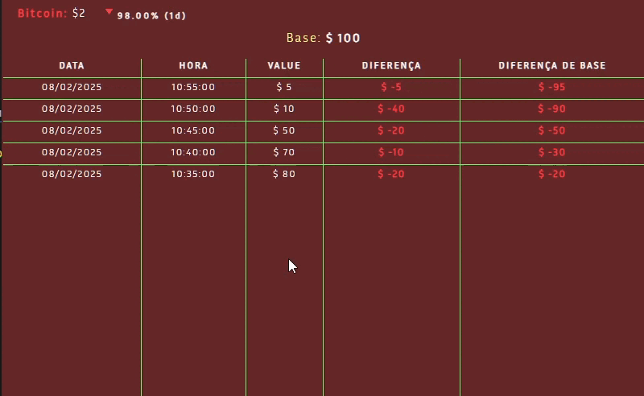

# 👨‍💻 **bitcoin-monitoring**

 

## Features

- Made with Electron JS in a Windows environment
- Monitor ${\color{#64defa}Bitcoin}$ with ${\color{#64defa}CoinmarketCap API}$
- A simple table with different topics regarding the bitcoin situation

  
  

---

- It is absolute in relation to every element present in the window.

- It has a personalized menu

---

 

# Install

> git clone https://github.com/NodeWillDev/bitcoin-monitoring.git

> cd bitcoin-monitoring

> npm install

> npm start

---

## Note: ${\color{#e1f533}Still\ under\ development}$
